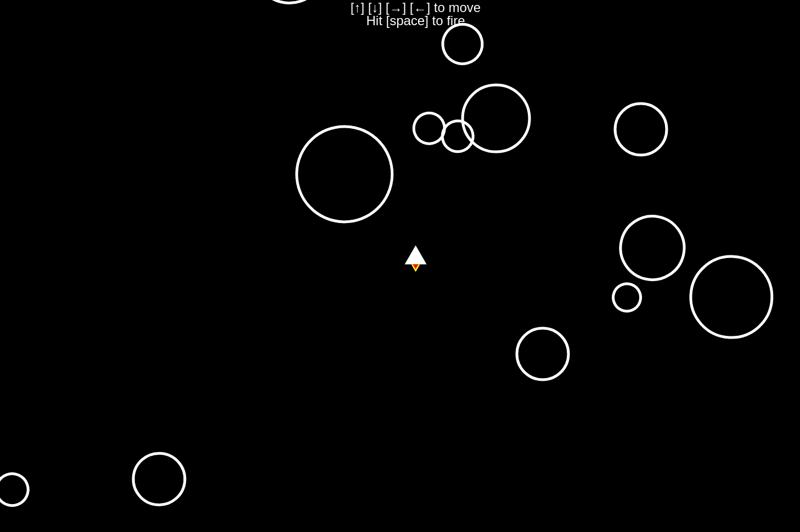
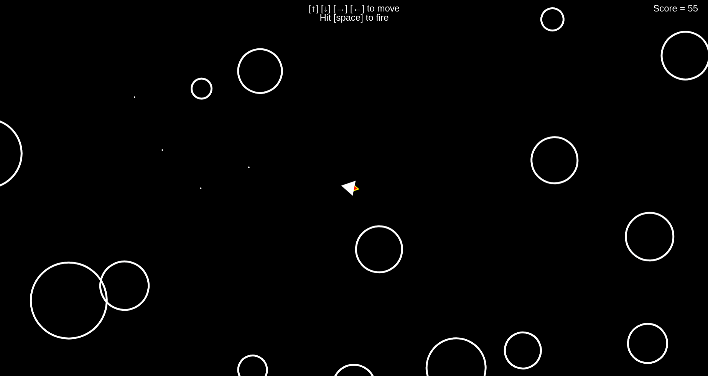
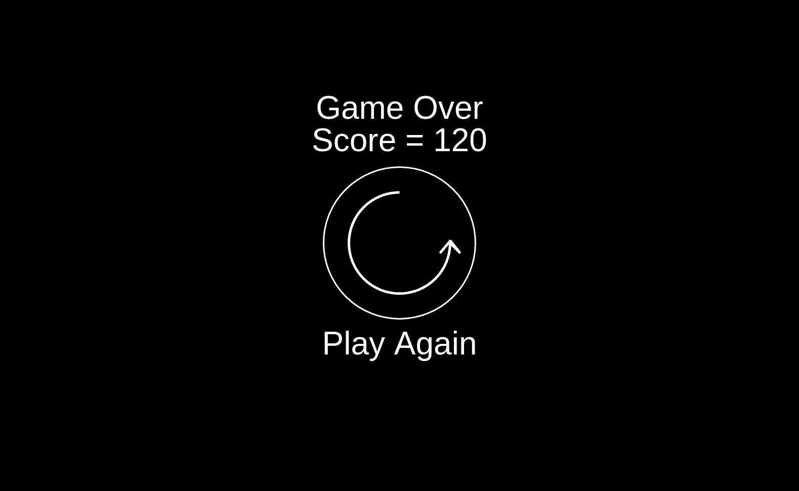
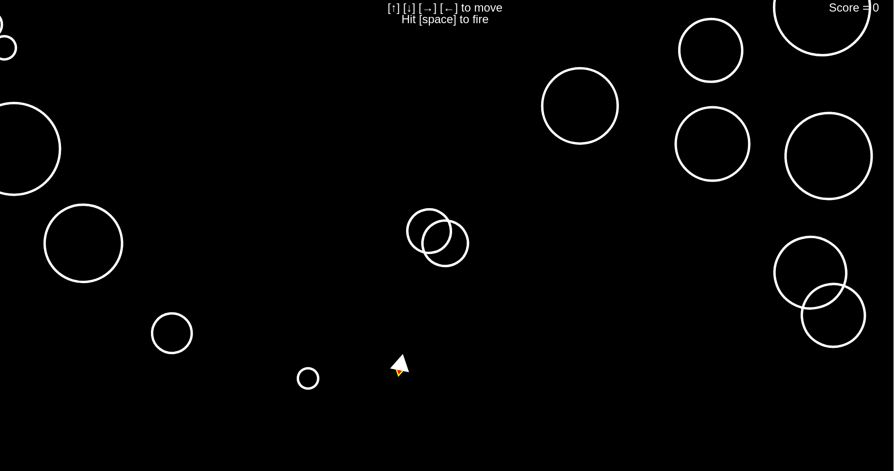
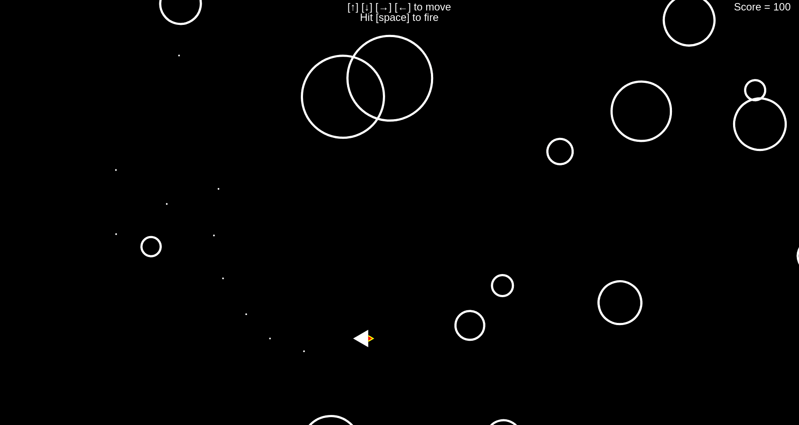

# SpaceInvaders
Asteroid Shooting Game using Javascript

## Pseudocode
* Building SpaceShip
  * [Create Fixed Ship](https://github.com/Shubham-Vishwakarma/SpaceInvaders/tree/main/part1-createfixedship)
  * [Adding Fake Flames to Ship](https://github.com/Shubham-Vishwakarma/SpaceInvaders/tree/main/part1.1-addflamestoship)
* SpaceShip Movement
  * [Move Ship Vertically](https://github.com/Shubham-Vishwakarma/SpaceInvaders/tree/main/part2-moveshipvertically)
  * [Rotate Spaceship](https://github.com/Shubham-Vishwakarma/SpaceInvaders/tree/main/part2.2-rotateship)
  * [Move Ship In All Direction](https://github.com/Shubham-Vishwakarma/SpaceInvaders/tree/main/part2.3-moveshipinalldirection)
* Shooting Missile
  * [Shooting Missile](https://github.com/Shubham-Vishwakarma/SpaceInvaders/tree/main/part3-shootingmissile)
* Adding Asteroids
  * [Add Static Asteroid](https://github.com/Shubham-Vishwakarma/SpaceInvaders/tree/main/part4-makingasteroids)
  * [Add Multiple Asteroids](https://github.com/Shubham-Vishwakarma/SpaceInvaders/tree/main/part4.1-addingmultipleasteriods)

## Output

